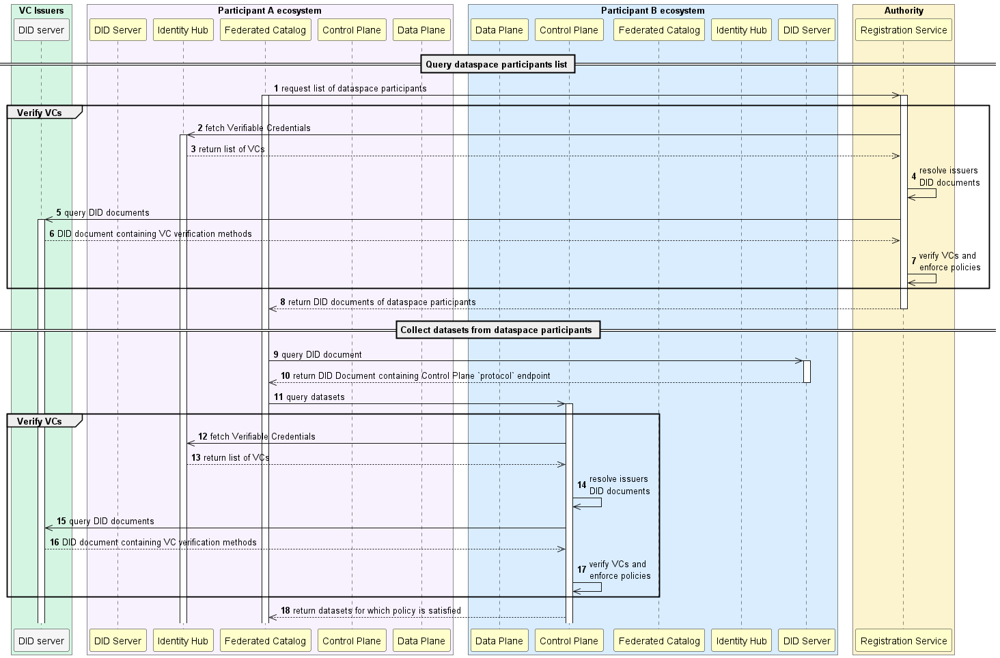

# Interaction between EDC components through REST APIs

## Interactions between EDC components

The interactions between EDC components of the dataspace participants and authority fall under 5 steps:
1. each participant fetches the full list of dataspace participants from the dataspace registration service, 
2. each participant browses this list and fetches the datasets exposed by the others participants. A consolidated view of all the datasets is stored locally (federated catalog cache), 
3. data consumer negotiates access to the dataset(s) exposed by the provider(s), which leads the generation of a contract stored by both parties, 
4. data consumer initiates the transfer; if the provider dataset is a REST API, then the consumer is given an endpoint data reference (EDR) containing a token to be used for querying the data, 
5. data consumer fetches the provider data by using its token.

These steps are depicted in the two diagrams below:

> **_NOTE:_** Note that the access token generated by the provider Control Plane at step (16) is not a random cryptographic token! 
> It contains the address of the data source (encrypted) used by the Data Plane at step (23)/(24) in order to determine from which internal resource (backend API, database...) the requested data must be fetched.

As shown in these diagrams, the EDC components of the participants and dataspace authority must open http ports on the public internet. 

More specifically, on participant side:
 - The Control Plane exposes:
   - a `protocol` port which is the port used for the connector-to-connector communication using the DSP protocol.
 - The Data Plane exposes:
   - a `public` port which is used to query data
 - The Identity Hub exposes:
   - an `identity` port used to write/read Verifiable Credentials
 - The DID server exposes:
   - a `did` port serving the DID document of the participant

On dataspace authority side:
 - The Registration Service exposes:
   - an `authority` endpoint used to add new dataspace participants (onboarding) and querying the list of dataspace participants
 - The Identity Hub exposes:
   - an `identity` port used to write/read Verifiable Credentials
 - The DID server exposes:
   - a `did` port serving the DID document of the participant

In production environments, microservices are generally not directly publicly exposed, but rather exposed through a _front door_ service which can typically 
be an API gateway, an application gateway, a firewall inbound port, or a combination of these.